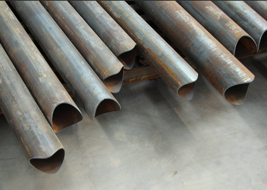
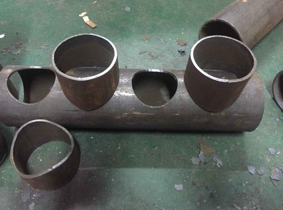
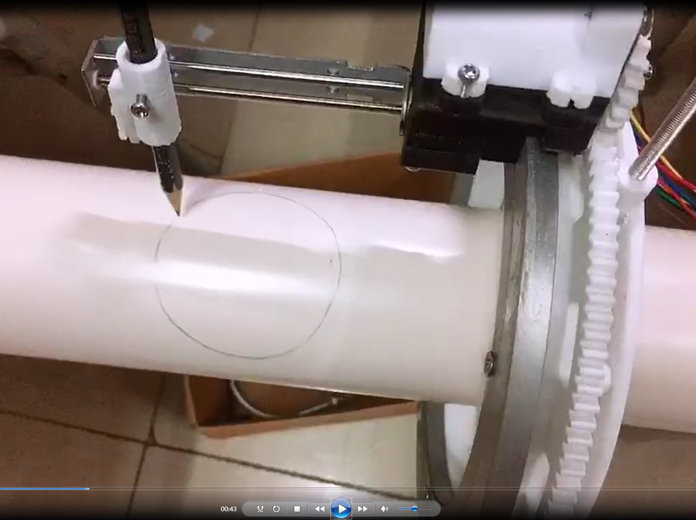

# 第十三届福建省大学生机械创新设计大赛（2019.01-2019.05）

## 题目信息

**题目3：简易型旋转等离子切割器**

**题目背景：**

钍对栏杆、管道等相接时，需要对管道结构件进行切割加工，此类加工以往大多采用制作样板、划线、人工放样、手工切割、人工打磨等落后繁复操作工艺。而采用数控相贯线切割机虽能十分方便的切割加工此类工件，但是市面价格昂贵。希望能开发一种简易型旋转等离子切割器。

**题目要求：**

可利用市场现有等离子切割机，完成对管道结构件进行切割，要求开发出一种利用旋转驱动装置，并依靠现有成品模块或直线驱动装置，实现各种管径（管径不大于300mm）的相贯线切割，要求CAD图、三维图和样机表达。

 

## 方案

- 成员：林章敏、黄国强、王子宣、陈东铭、郝家骏，获得省一等奖。

- 基于 Arduino 开发平台，根据已有的相贯线三维数学模型进行编程，实现输入任意相关参数，即可获得相应的空间相贯线。将等离子喷头加紧在步进电机上，由 Arduino 控制步进电机运动，从而实现相贯线的切割。

- 效果视频如下(未能网页显示)

  

      <video width="320" height="240" controls>
    		<source  src="./简易型等离子切割系统.mp4" type="video/mp4"/>
  	</video>
  

- 部分视频截图

