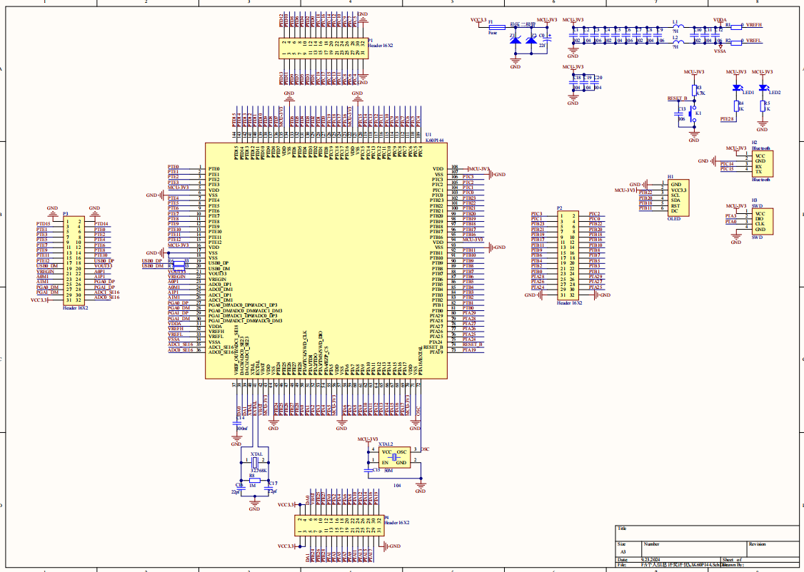
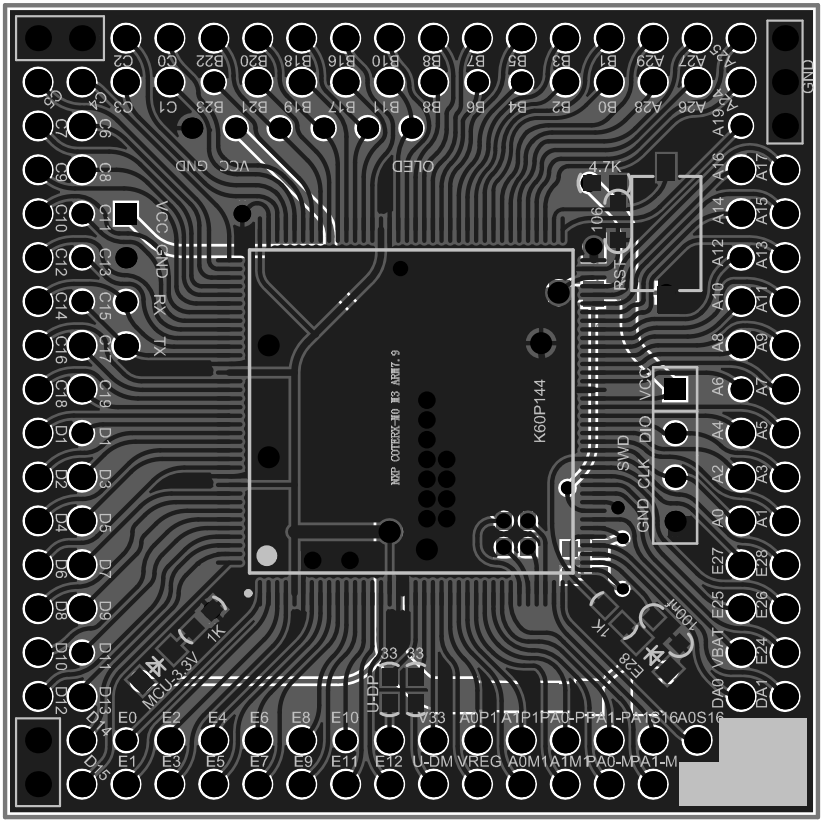
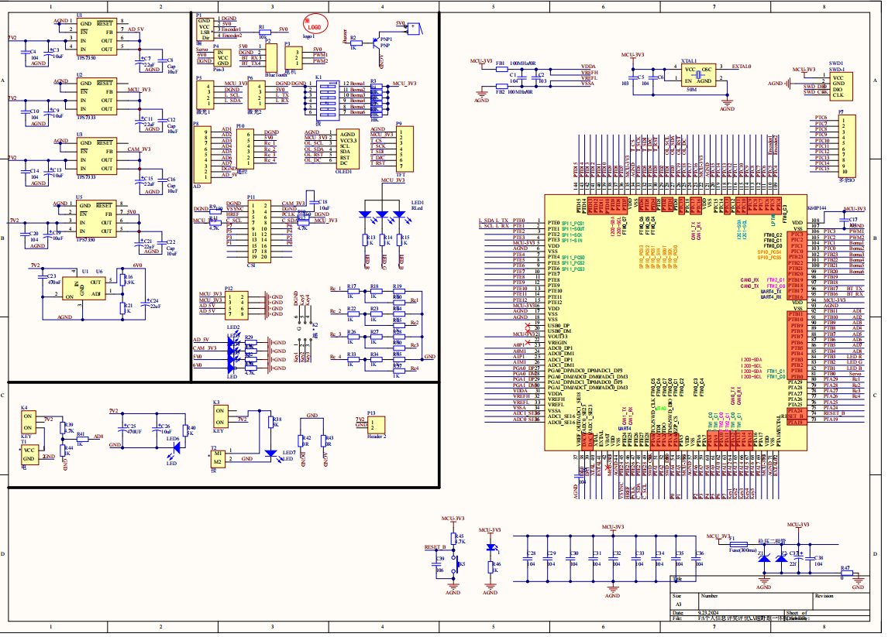
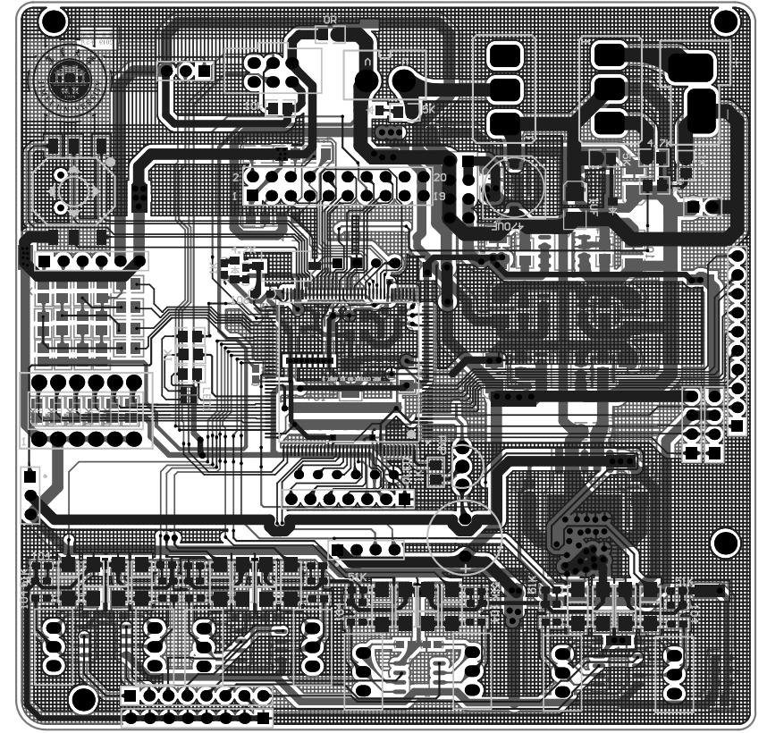
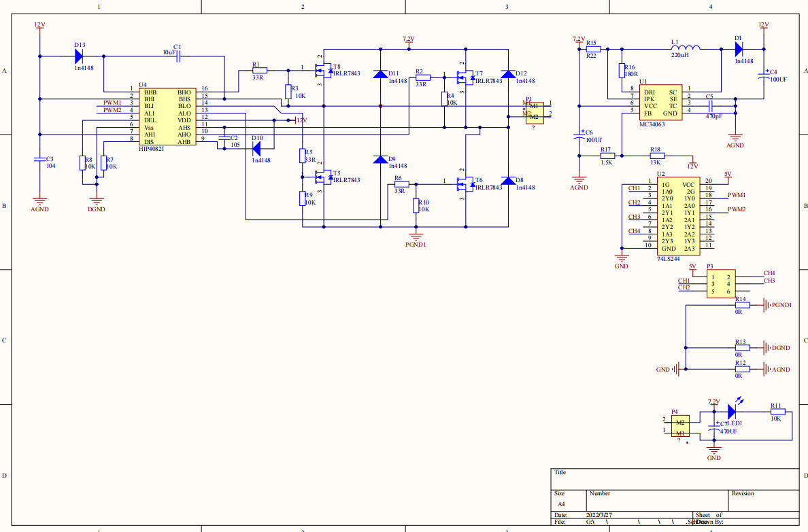
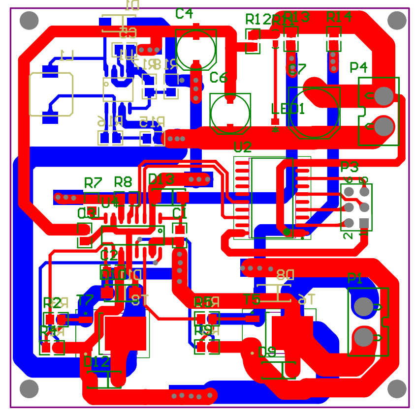
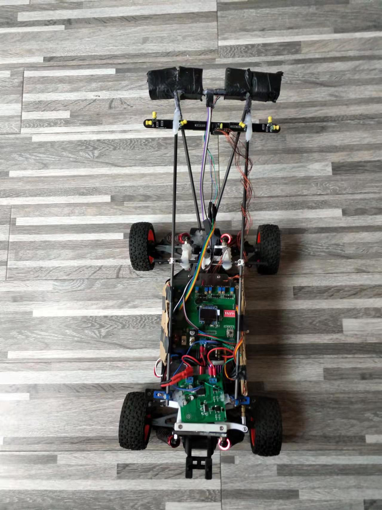

# 第十四届“恩智浦”杯智能汽车竞赛（2018.11-2019.09）

- 组别为“室外越野组”。

- 该比赛以智能汽车为研究对象的创意性科技竞赛，制作一个能够自主识别路径的智能车，在专门设计的跑道上自动识别道路行驶。需要在 MK60DN512 单片机基础平台上，熟练应用嵌入式开发软件 IAR、AD10 等辅助工具，熟练操作示波器，万用表等测试工具进行测试。

## 软件

略

## 硬件电路

- K60最小系统板

- 越野组一体板

- 单相7.2v驱动电路

## 结构设计

- 前轮舵机结构修改模型

.jpg)

- 整车车模
